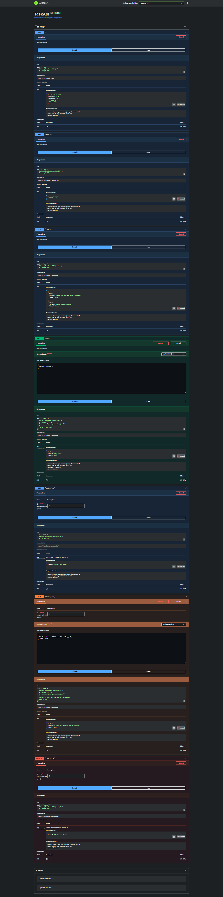

# BE-01: Task Management CRUD API (.NET 10)

A lightweight To-Do List CRUD API built with **ASP.NET Core Minimal APIs** and C# for FlyRank Backend AI Engineering Track.

## 🚀 Features
- Full CRUD operations on an in-memory task collection.
- OpenAPI / Swagger UI documentation.
- Input validation (400 Bad Request for empty titles).
- Proper HTTP status codes (200, 201, 204, 400, 404).

## 📌 Endpoints

| Method | Endpoint | Description | Success Status | Error Status |
| :--- | :--- | :--- | :--- | :--- |
| `GET` | `/` | API Information | 200 OK | - |
| `GET` | `/health` | Health Check | 200 OK | - |
| `GET` | `/tasks` | List all tasks | 200 OK | - |
| `GET` | `/tasks/{id}` | Get task by ID | 200 OK | 404 Not Found |
| `POST` | `/tasks` | Create a new task | 201 Created | 400 Bad Request |
| `PUT` | `/tasks/{id}` | Update a task | 200 OK | 400 Bad Request / 404 Not Found |
| `DELETE` | `/tasks/{id}` | Delete a task | 204 No Content | 404 Not Found |

## 🛠️ How to Run
1. Make sure [.NET 10 SDK](https://dotnet.microsoft.com/download) is installed.
2. Clone the repository:
   ```bash
   git clone <YOUR_GITHUB_REPO_URL>
   cd TaskApi
   ```
3. Run the API:
   ```bash
   dotnet run
   ```
4. Access Swagger UI at: `https://localhost:7240/swagger`

## 📊 Swagger UI Screenshot

